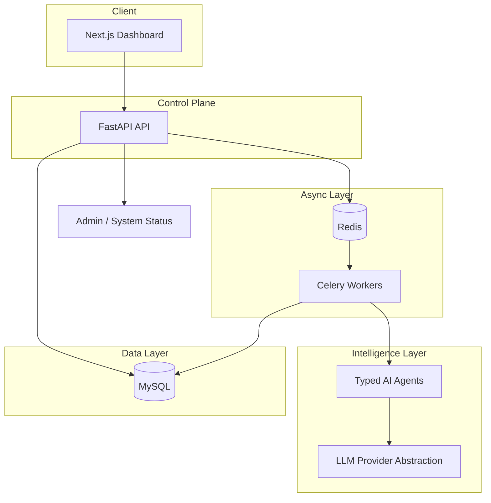

# CreatorOS

**AI Agent Platform for Content Creators**

CreatorOS is a SaaS monorepo that turns audience signals into trends, content, and growth coaching — orchestrated by typed AI agents behind a Next.js dashboard, FastAPI API, and Celery workers.

**Live demo:** [https://creator-os-gold.vercel.app](https://creator-os-gold.vercel.app)  
Demo login: `daniela@creatoros.demo` / `demo1234`

> Built to demonstrate **Principal / Founding Engineer–level system design**: clear service boundaries, provider-agnostic AI, async job orchestration, observability baselines, and architecture documentation — not a prompt wrapper.

---

## What This Project Demonstrates

| Engineering signal | How CreatorOS shows it |
|---|---|
| **System decomposition** | Web, API, worker, and shared packages with explicit ownership |
| **AI as infrastructure** | Agents + provider abstraction — swap LLM backends via env config |
| **Async by default** | Long-running AI jobs offloaded to Celery; API stays responsive |
| **Operational readiness** | Structured JSON logs, request IDs, rate limiting, admin status endpoint |
| **Data discipline** | SQLAlchemy models, Alembic migrations, `agent_runs` audit trail for every AI execution |
| **Security thinking** | Prompt-injection guardrails, task allowlisting, JWT demo auth (explicitly labeled) |
| **Cost awareness** | Token usage captured per agent run; mock provider for zero-cost production demo |

---

## Product Overview

| Feature | Description |
|---|---|
| **Daily briefing** | Synthesizes trends, calendar, and audience context into today's action plan |
| **Trend discovery** | Platform-filtered topics with confidence scoring and generate-from-trend flow |
| **Content generator** | Structured outputs: hook, caption, script, hashtags, CTA |
| **Growth coach** | Chat-based coaching with markdown rendering and persisted history |
| **Content calendar** | Monthly/list views and status badges |
| **Platform integrations** | OAuth scaffold for Instagram and YouTube (configure keys in env) |

---

## Demo Flow

| | URL |
|---|---|
| **Dashboard** | [creator-os-gold.vercel.app](https://creator-os-gold.vercel.app) |
| **API health** | [creator-os-gold.vercel.app/api/v1/health](https://creator-os-gold.vercel.app/api/v1/health) |

1. Sign in with `daniela@creatoros.demo` / `demo1234`
2. **Home** — daily briefing, trend alerts, platform stats (seeded creator persona)
3. Walk through **Trends** → **Generator** → **Calendar** → **AI Coach** → **Settings**

Deployed via [Vercel Services](https://vercel.com/docs/services) (`vercel.json`): Next.js web + FastAPI API on one domain (`/api/v1` same-origin).

**Push to `main`** → [CI](.github/workflows/ci.yml) runs tests → **Deploy to Vercel** ships web + API. See [`docs/DEPLOYMENT.md`](docs/DEPLOYMENT.md) for env sync and local development.

---

## Screenshots


---

## Architecture



**Request path:** Client → FastAPI (auth + validation + rate limit) → sync response or Celery enqueue → Agent pipeline → LLM provider → persist `agent_runs` → client reads updated state.

Full docs: [`docs/ARCHITECTURE.md`](docs/ARCHITECTURE.md) · [`docs/AI_AGENT_DESIGN.md`](docs/AI_AGENT_DESIGN.md) · [`docs/SECURITY.md`](docs/SECURITY.md)

---

## AI Agents

Domain agents in `shared/agents/` — each with typed input/output, prompt templates, and run tracking:

| Agent | Responsibility |
|---|---|
| `TrendResearchAgent` | Discover and rank platform-relevant trends for a niche |
| `ContentWriterAgent` | Generate platform-ready content from trends or briefs |
| `GrowthCoachAgent` | Coaching dialogue with structured recommendations |
| `AudienceAnalystAgent` | Synthesize audience insights from signals |
| `SummarizerAgent` | Condense long-form context for downstream agents |

---

## LLM Providers

`shared/ai_core/` defines a stable contract: `generate_text`, `generate_json`, `stream_text`.

| Provider | Where | Notes |
|---|---|---|
| **Mock** | Vercel (production) | Deterministic coach responses — `LLM_PROVIDER=mock`, no API key |
| **Hermes (Ollama)** | Local dev | Real LLM via `LLM_PROVIDER=hermes` and `cd api && make dev` |

Switching providers is an env change, not a refactor.

---

## Tech Stack

| Layer | Technology |
|---|---|
| **Frontend** | Next.js (App Router), React, TypeScript, Tailwind |
| **Backend** | FastAPI, Pydantic, SQLAlchemy, Alembic |
| **Jobs** | Celery + Redis |
| **Database** | MySQL |
| **AI** | Custom provider layer + typed agents |
| **Hosting** | Vercel Services (web + API) |
| **Testing** | pytest (API), Vitest (web) |

---

## Repository Layout

```text
CreatorOS/
├── web/                        # Next.js dashboard
├── api/
│   ├── app/                    # FastAPI (routers, services, repositories)
│   └── worker/                 # Celery background jobs
├── shared/
│   ├── ai_core/                # LLM provider abstraction
│   ├── agents/                 # Typed AI agents + prompt manager
│   └── database/               # SQLAlchemy models + Alembic migrations
├── docs/                       # Architecture, security, deployment
├── vercel.json                 # Vercel Services (web + API)
└── docker-compose.yml          # Optional local full stack
```

---

## Tests

| Suite | Command |
|---|---|
| **Backend** | `cd api && python -m pytest tests -q` |
| **Frontend** | `cd web && pnpm test` |

---

## Authentication

> **Demo auth only** — not production-ready.

`POST https://creator-os-gold.vercel.app/api/v1/auth/token` accepts any email + password (≥ 8 chars), auto-provisions users, returns JWT with `"auth_mode": "demo"`.

---

## API Surface

**Base URL:** `https://creator-os-gold.vercel.app/api/v1`

| Domain | Routes |
|---|---|
| Health | `GET /health`, `GET /admin/system-status` |
| Auth | `POST /auth/token` |
| Creator | `POST /creators`, `GET /creators/{id}`, `PATCH /creators/{id}/*` |
| Trends | `GET /trends/latest`, `POST /trends/run-research` |
| Content | `POST /content-ideas/generate`, `GET /content-ideas` |
| Calendar | `POST /calendar`, `GET /calendar`, `PATCH /calendar/{id}/*` |
| Coach | `POST /coach/chat` |
| Integrations | `GET /integrations/platforms`, `POST /integrations/platforms/{platform}/connect` |

---

## Documentation

| Document | Focus |
|---|---|
| [`DEPLOYMENT.md`](docs/DEPLOYMENT.md) | Vercel, GitHub Actions CI/CD, Docker, env vars |
| [`ARCHITECTURE.md`](docs/ARCHITECTURE.md) | Service boundaries, data flow |
| [`AI_AGENT_DESIGN.md`](docs/AI_AGENT_DESIGN.md) | Agent lifecycle, prompt safety |
| [`SECURITY.md`](docs/SECURITY.md) | Auth roadmap, rate limits |
| [`PRODUCT_ROADMAP.md`](docs/PRODUCT_ROADMAP.md) | Planned features |
| [`DATABASE_SCHEMA.md`](docs/DATABASE_SCHEMA.md) | Tables and migrations |

---

## Status

Live at [creator-os-gold.vercel.app](https://creator-os-gold.vercel.app). The hosted demo uses **mock AI** for coach and content flows. Typed agents, MySQL persistence, and Vercel Services deployment are in place; see [`docs/PRODUCT_ROADMAP.md`](docs/PRODUCT_ROADMAP.md) for what's next.
