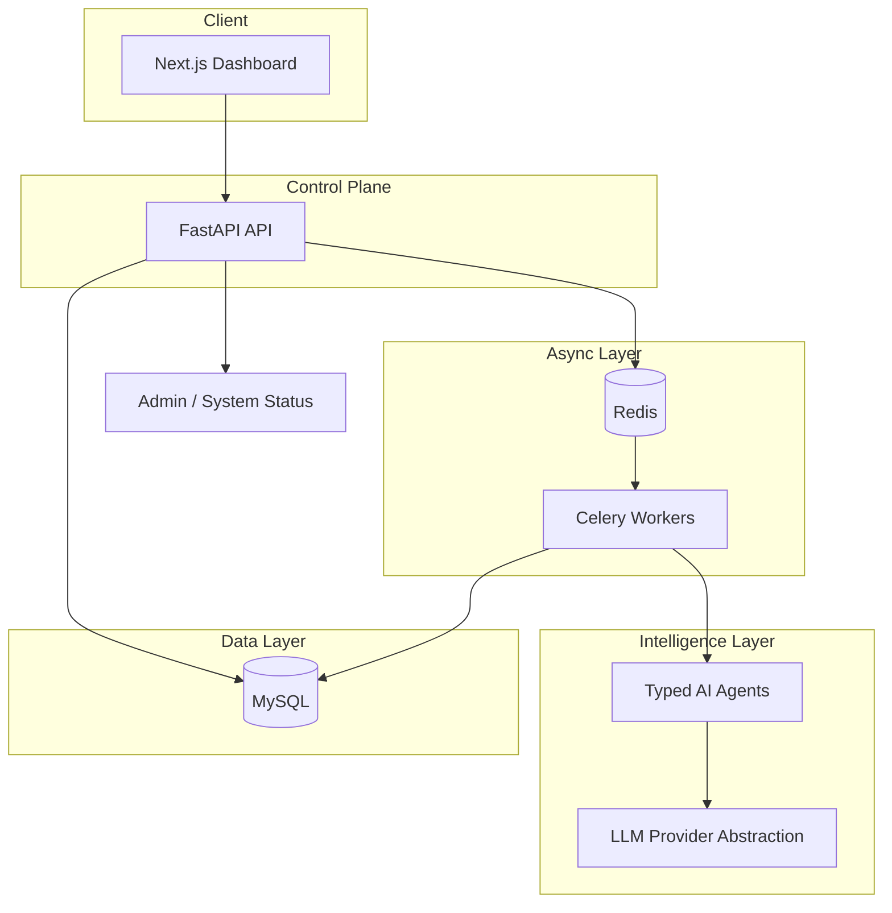

# CreatorOS

**AI Agent Platform for Content Creators**

CreatorOS is a production-style SaaS monorepo that turns audience signals into trends, content, and growth coaching — orchestrated by typed AI agents behind a Next.js dashboard, FastAPI control plane, and Celery workers.

**Live demo:** [https://creator-os-gold.vercel.app](https://creator-os-gold.vercel.app)  
Demo login: `daniela@creatoros.demo` / `demo1234`

> Built to demonstrate **Principal / Founding Engineer–level system design**: clear service boundaries, provider-agnostic AI, async job orchestration, observability baselines, and CTO-grade architecture documentation — not a prompt wrapper.

---

## What This Project Demonstrates

Most "AI apps" are a single LLM call behind a form. CreatorOS is designed like a real platform:

| Engineering signal | How CreatorOS shows it |
|---|---|
| **System decomposition** | Web, API, worker, and shared packages with explicit ownership |
| **AI as infrastructure** | Agents + provider abstraction — swap OpenAI for Claude/Gemini without rewriting business logic |
| **Async by default** | Long-running AI jobs offloaded to Celery; API stays responsive |
| **Operational readiness** | Structured JSON logs, request IDs, rate limiting, admin status endpoint |
| **Data discipline** | SQLAlchemy models, Alembic migrations, `agent_runs` audit trail for every AI execution |
| **Security thinking** | Prompt-injection guardrails, task allowlisting, JWT auth scaffold, explicit demo-auth labeling |
| **Cost awareness** | Token usage + cost captured per agent run; mock provider for zero-cost local dev |
| **Documentation depth** | Architecture, agent design, security, scaling, and cost docs — not an afterthought |

This is the kind of repo a hiring manager opens and immediately sees: *this person thinks in systems, not scripts.*

---

## Product Overview

Creators run growth across fragmented tools — trends in one tab, writing in another, scheduling in a third, with no shared memory.

CreatorOS unifies that into one intelligence layer:

| Feature | Description |
|---|---|
| **Daily briefing** | Synthesizes trends, calendar, and audience context into today's action plan |
| **Trend discovery** | Platform-filtered topics with confidence scoring and generate-from-trend flow |
| **Content generator** | Structured outputs: hook, caption, script, hashtags, CTA |
| **Growth coach** | Chat-based coaching with markdown rendering and persisted history |
| **Content calendar** | Monthly/list views, drag-and-drop rescheduling, status badges |
| **Platform integrations** | OAuth for Instagram Business Login, YouTube, and extensible provider registry |

---

## Demo Flow (5 minutes)

### Live (Vercel)

| | URL |
|---|---|
| **Dashboard** | [creator-os-gold.vercel.app](https://creator-os-gold.vercel.app) |
| **API** | [creator-os-gold.vercel.app/api/v1/health](https://creator-os-gold.vercel.app/api/v1/health) |

1. Open the dashboard and sign in with `daniela@creatoros.demo` / `demo1234`
2. **Home** — daily briefing, trend alerts, platform stats (seeded creator persona)
3. **Trends** → **Generator** → **Calendar** → **AI Coach** → **Settings**

Deployed via [Vercel Services](https://vercel.com/docs/services) (`vercel.json`): Next.js web + FastAPI API on one domain (`/api/v1` same-origin).

### Local development

```bash
git clone <repo-url> && cd CreatorOS
cp api/.env.example api/.env.local
cp web/.env.example web/.env.local
docker compose up --build
# or: cd api && make dev  &&  cd web && pnpm dev
```

| Service | URL |
|---|---|
| Dashboard | http://localhost:3000 |
| API | http://localhost:8000/api/v1 |

Log in with any email + password (8+ chars). Demo auth auto-provisions users (`auth_mode: "demo"`).

**Show the engineering** — open `docs/ARCHITECTURE.md`, inspect `agent_runs` in MySQL, and explain the provider abstraction in `shared/ai_core/`.

---

## Screenshots

### Dashboard (production — creator-os-gold.vercel.app)


### Additional views (placeholders — swap with product captures)

| Trends | Generator | Coach | Calendar |
|:---:|:---:|:---:|:---:|
|  |  |  |  |

---

## Architecture



**Request path:** Client → FastAPI (auth + validation + rate limit) → sync response or Celery enqueue → Agent pipeline → LLM provider → persist `agent_runs` → client reads updated state.

**Agent execution lifecycle:** validate input → create `agent_runs` row → build prompt → call provider → validate output schema → persist tokens/cost/latency → return.

Full docs: [`docs/ARCHITECTURE.md`](docs/ARCHITECTURE.md) · [`docs/AI_AGENT_DESIGN.md`](docs/AI_AGENT_DESIGN.md) · [`docs/SECURITY.md`](docs/SECURITY.md)

---

## Architecture Decisions

| Decision | Choice | Why |
|---|---|---|
| **Monorepo** | `web/` + `api/` + `shared/` | Shared agents, models, and providers consumed by API and worker without duplication |
| **Database** | MySQL (MVP) | Fast iteration, managed-hosting compatible, Alembic migrations in place |
| **Vector memory** | PostgreSQL + pgvector (planned) | Semantic search and RAG over creator history — documented migration path, not yet implemented |
| **LLM coupling** | Provider abstraction (`shared/ai_core`) | Agents never import vendor SDKs; routing policies become a config concern |
| **Long-running AI** | Celery + Redis | API latency stays bounded; workers scale independently by job class |
| **Agent contracts** | Pydantic I/O + JSON schema validation | Structured, testable, retryable outputs — not free-form text parsing |
| **Auth** | Demo JWT (labeled) | Zero-friction demos; production path documented (hashing + GitHub OAuth) |
| **Observability** | JSON logs + request IDs + admin endpoint | Baseline before Prometheus/OpenTelemetry; enough to debug production incidents |

---

## AI Agents

Domain agents in `shared/agents/` — each with typed input/output, prompt templates, and full run tracking:

| Agent | Responsibility |
|---|---|
| `TrendResearchAgent` | Discover and rank platform-relevant trends for a niche |
| `ContentWriterAgent` | Generate platform-ready content from trends or briefs |
| `GrowthCoachAgent` | Coaching dialogue with structured recommendations |
| `AudienceAnalystAgent` | Synthesize audience insights from signals |
| `SummarizerAgent` | Condense long-form context for downstream agents |

Prompt manager includes versioned templates, validation retries, and prompt-injection guardrails.

---

## LLM Provider Abstraction

`shared/ai_core/` defines a stable contract: `generate_text`, `generate_json`, `stream_text`.

| Provider | Status | Notes |
|---|---|---|
| **OpenAI** | Implemented | Production path via `LLM_PROVIDER=openai` |
| **Mock** | Implemented | Default for local dev — no API key needed |
| **Claude** | Extension point | Interface ready, API wiring pending |
| **Gemini** | Extension point | Interface ready, API wiring pending |
| **OpenRouter** | Extension point | Multi-model routing stub |
| **Hermes (local)** | Extension point | Self-hosted / Ollama path stub |

Switching providers is an env change, not a refactor.

---

## Tech Stack

| Layer | Technology |
|---|---|
| **Frontend** | Next.js (App Router), React, TypeScript, Tailwind |
| **Backend** | FastAPI, Pydantic, SQLAlchemy, Alembic |
| **Jobs** | Celery + Redis |
| **Database** | MySQL (current) |
| **AI** | Custom provider layer + typed agents |
| **Testing** | pytest (API), Vitest (web) |
| **Ops** | Docker Compose, structured JSON logs, rate limiting |

---

## Repository Layout

```text
CreatorOS/
├── web/                        # Next.js dashboard
├── api/
│   ├── app/                    # FastAPI (routers, services, repositories)
│   │   └── api/v1/routers/     # integrations, trends, coach, calendar, …
│   └── worker/                 # Celery background jobs
├── shared/
│   ├── ai_core/                # LLM provider abstraction
│   ├── agents/                 # Typed AI agents + prompt manager
│   └── database/               # SQLAlchemy models + Alembic migrations
├── docs/                       # Architecture, security, scaling, roadmap
├── docker-compose.yml          # One-command full stack
└── .env.example
```

---

## Setup

### Docker (recommended)

```bash
cp api/.env.example api/.env
docker compose up --build

# With Hermes/Ollama coach:
# Set LLM_PROVIDER=hermes in api/.env, then:
docker compose --profile hermes up --build
```

### Local (without Docker)

```bash
# Frontend
cd web && corepack pnpm install && corepack pnpm dev

# API (with Hermes/Ollama — starts Ollama automatically when LLM_PROVIDER=hermes)
cd api && python3 -m venv .venv && source .venv/bin/activate
pip install -r requirements.txt && cp .env.example .env.local
make dev
# Or manually: brew services start ollama && uvicorn app.main:app --reload --port 8000

# Worker
cd api/worker && celery -A worker_app.celery_app worker --loglevel=INFO
```

### Deploy (Vercel + GitHub)

**Production:** [https://creator-os-gold.vercel.app](https://creator-os-gold.vercel.app)

Vercel is connected to GitHub — pushes to `main` deploy automatically. [`vercel.json`](vercel.json) runs **web + API** from the repo root (same-origin `/api/v1`).

```bash
./scripts/sync-github-env.sh --repo KOfferman/CreatorOS   # CI secrets/vars
python3 scripts/push-vercel-env.py                        # Vercel env (api/.env.vercel)
```

Full guide: [`docs/DEPLOYMENT.md`](docs/DEPLOYMENT.md)

---

## Tests

| Suite | Command | Coverage |
|---|---|---|
| **Backend** | `cd api && python -m pytest tests -q` | 9 tests — endpoints, agents (mocked LLM), repos, Celery, social OAuth |
| **Frontend** | `cd web && corepack pnpm test --run` | Dashboard page render |

---

## Authentication

> **Demo auth only** — explicitly labeled, not production-ready.

`POST /api/v1/auth/token` accepts any email + password (≥ 8 chars), auto-provisions users, returns JWT with `"auth_mode": "demo"`.

Production roadmap: password hashing (schema ready), GitHub OAuth — [`docs/SECURITY.md`](docs/SECURITY.md).

---

## API Surface

| Environment | Base URL |
|---|---|
| **Production (Vercel)** | `https://creator-os-gold.vercel.app/api/v1` |
| **Local** | `http://localhost:8000/api/v1` |

| Domain | Routes |
|---|---|
| Health | `GET /health`, `GET /admin/system-status` |
| Auth | `POST /auth/token` |
| Creator | `POST /creators`, `GET /creators/{id}`, `PATCH /creators/{id}/*` |
| Trends | `GET /trends/latest`, `POST /trends/run-research` |
| Content | `POST /content-ideas/generate`, `GET /content-ideas` |
| Calendar | `POST /calendar`, `GET /calendar`, `PATCH /calendar/{id}/*` |
| Coach | `POST /coach/chat` |
| Integrations | `GET /integrations/platforms`, `POST /integrations/platforms/{platform}/connect` |

---

## Documentation

| Document | Focus |
|---|---|
| [`DEPLOYMENT.md`](docs/DEPLOYMENT.md) | Vercel Services, GitHub Actions CI/CD, Docker, env vars |
| [`ARCHITECTURE.md`](docs/ARCHITECTURE.md) | Service boundaries, data flow, deployment topology |
| [`AI_AGENT_DESIGN.md`](docs/AI_AGENT_DESIGN.md) | Agent lifecycle, prompt safety, provider contract |
| [`SECURITY.md`](docs/SECURITY.md) | Auth roadmap, rate limits, injection guardrails |
| [`SCALING_STRATEGY.md`](docs/SCALING_STRATEGY.md) | Queue splitting, read replicas, SLO planning |
| [`COST_OPTIMIZATION.md`](docs/COST_OPTIMIZATION.md) | Token budgets, model routing, caching |
| [`PRODUCT_ROADMAP.md`](docs/PRODUCT_ROADMAP.md) | 12-month feature roadmap |
| [`DATABASE_SCHEMA.md`](docs/DATABASE_SCHEMA.md) | Tables, relationships, migration history |

---

## Roadmap

| Phase | Focus |
|---|---|
| **Now** | MVP dashboard, typed agents, mock LLM, MySQL, demo auth |
| **Next** | PostgreSQL + pgvector for semantic creator memory |
| **Then** | Provider routing (quality/cost/latency), multi-user workspaces |
| **Later** | Agent eval datasets, GitHub OAuth, enterprise compliance |

Full plan: [`docs/PRODUCT_ROADMAP.md`](docs/PRODUCT_ROADMAP.md)

---

## Status

Live at [creator-os-gold.vercel.app](https://creator-os-gold.vercel.app). Production-oriented foundations are in place — Docker for local dev, Vercel Services for hosted web + API, typed agents with provider abstraction, and full architecture docs. Clone and run `docker compose up` for a zero-cost local loop with mock AI.
