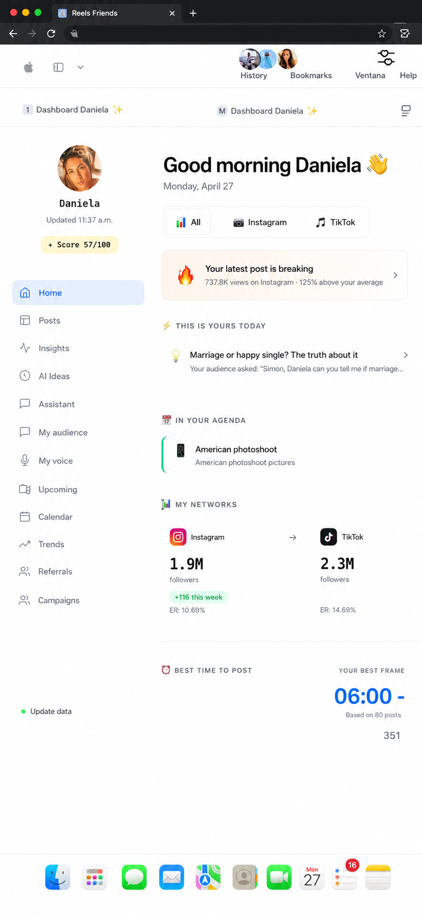
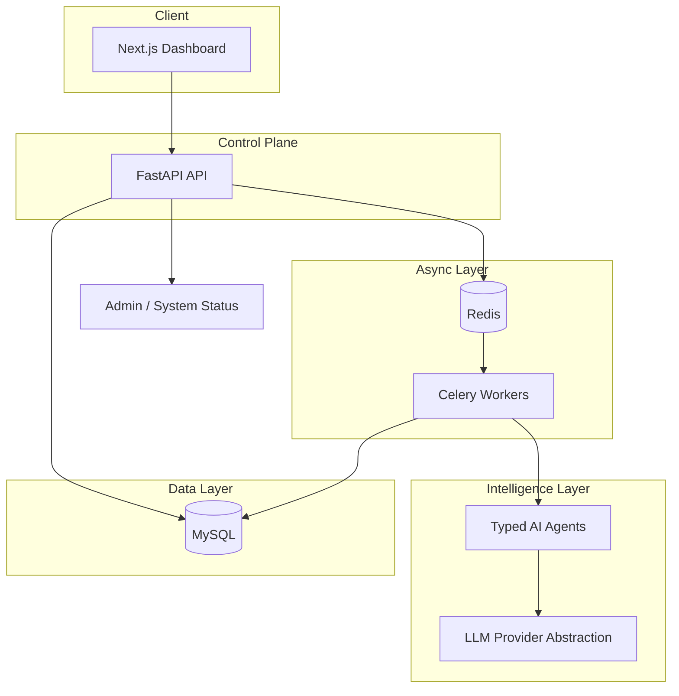

# CreatorOS

**AI Agent Platform for Content Creators**

CreatorOS is a SaaS monorepo that turns audience signals into trends, content, and growth coaching — orchestrated by typed AI agents behind a Next.js dashboard, FastAPI API, and Celery workers.

**Live demo:** [https://creator-os-gold.vercel.app](https://creator-os-gold.vercel.app)  
Demo login: `daniela@creatoros.demo` / `demo1234`

> Built to demonstrate **Principal / Founding Engineer–level system design**: clear service boundaries, provider-agnostic AI, async job orchestration, observability baselines, and architecture documentation — not a prompt wrapper.

---

## What This Project Demonstrates

| Engineering signal | How CreatorOS shows it |
|---|---|
| **System decomposition** | Web, API, worker, and shared packages with explicit ownership |
| **AI as infrastructure** | Agents + provider abstraction — swap LLM backends via env config |
| **Async by default** | Long-running AI jobs offloaded to Celery; API stays responsive |
| **Operational readiness** | Structured JSON logs, request IDs, rate limiting, admin status endpoint |
| **Data discipline** | SQLAlchemy models, Alembic migrations, `agent_runs` audit trail for every AI execution |
| **Security thinking** | Bcrypt password auth, JWT from cookie only in prod, multi-tenant row-level isolation, production guardrails |
| **Cost awareness** | Token usage captured per agent run; mock provider for zero-cost production demo |

---

## Product Overview

| Feature | Description |
|---|---|
| **Daily briefing** | Synthesizes trends, calendar, and audience context into today's action plan |
| **Trend discovery** | RSS-fed research (Reddit) + LLM ranking; seeded dashboard trends for demo UX |
| **Content generator** | Structured outputs: hook, caption, script, hashtags, CTA |
| **Growth coach** | Chat-based coaching with markdown rendering and persisted history |
| **Content calendar** | Monthly/list views and status badges |
| **Platform integrations** | OAuth scaffold for Instagram and YouTube (configure keys in env) |

---

## Demo Flow

| | URL |
|---|---|
| **Dashboard** | [creator-os-gold.vercel.app](https://creator-os-gold.vercel.app) |
| **API health** | [creator-os-gold.vercel.app/api/v1/health](https://creator-os-gold.vercel.app/api/v1/health) |

1. Sign in with `daniela@creatoros.demo` / `demo1234`
2. **Home** — daily briefing, trend alerts, platform stats (seeded creator persona)
3. Walk through **Trends** → **Generator** → **Calendar** → **AI Coach** → **Settings**

Deployed via [Vercel Services](https://vercel.com/docs/services) (`vercel.json`): Next.js web + FastAPI API on one domain (`/api/v1` same-origin).

**Push to `main`** → [CI](.github/workflows/ci.yml) runs tests → **Deploy to Vercel** ships web + API. See [`docs/DEPLOYMENT.md`](docs/DEPLOYMENT.md) for env sync and local development.

---

## Screenshots



---

## Architecture



**Request path:** Client → FastAPI (auth + validation + rate limit) → sync response or Celery enqueue → Agent pipeline → LLM provider → persist `agent_runs` → client reads updated state.

> **Architecture note:** The current implementation uses MySQL as the relational database to keep deployment straightforward for the MVP. The application was designed with a repository abstraction so the storage engine is interchangeable. For production deployments requiring vector search, retrieval-augmented generation (RAG), and semantic memory, I would recommend PostgreSQL with pgvector.

Full docs: [`docs/ARCHITECTURE.md`](docs/ARCHITECTURE.md) · [`docs/AI_AGENT_DESIGN.md`](docs/AI_AGENT_DESIGN.md) · [`docs/SECURITY.md`](docs/SECURITY.md)

---

## Database

CreatorOS currently uses **MySQL** for the MVP to keep deployment simple and portable across the selected hosting environment.

The persistence layer is intentionally abstracted using the Repository pattern, making the application database-agnostic. Migrating to another relational database requires minimal changes outside the infrastructure layer.

For a production AI platform, my preferred architecture would use **PostgreSQL + pgvector** to support semantic search, vector embeddings, retrieval-augmented generation (RAG), and long-term AI memory.

---

## AI Agents

Domain agents in `shared/agents/` — each with typed input/output, prompt templates, and run tracking:

| Agent | Responsibility |
|---|---|
| `TrendResearchAgent` | Discover and rank platform-relevant trends for a niche |
| `ContentWriterAgent` | Generate platform-ready content from trends or briefs |
| `GrowthCoachAgent` | Coaching dialogue with structured recommendations |
| `AudienceAnalystAgent` | Synthesize audience insights from signals |
| `SummarizerAgent` | Condense long-form context for downstream agents |

---

## Architecture Decisions

| Decision | Choice | Tradeoff |
|---|---|---|
| **Monorepo** | `web/` + `api/` + `shared/` | Shared agents/DB without publishing packages; larger repo |
| **Database** | MySQL (Hostinger prod, Docker local) | Honest choice for managed hosting; Postgres + pgvector documented as future path for embeddings |
| **Auth** | Bcrypt + JWT (`auth_mode: password`) | Production uses hashed passwords; `DEMO_AUTH_ENABLED=true` only for local dev |
| **Session transport** | HttpOnly cookie (prod); Bearer in localStorage (cross-origin dev only) | Vercel same-origin uses secure cookies; `localhost:3000` → `:8000` keeps dev Bearer fallback |
| **Multi-tenant isolation** | `user_id` from JWT only | No client-supplied `user_id`; repositories scope update/delete by owner |
| **Admin RBAC** | `ADMIN_USER_IDS` allowlist | `/admin/*` requires configured admin user id, not just any JWT |
| **Rate limiting** | Redis required in prod/staging | No in-memory fallback on Vercel; set `REDIS_URL` to Upstash (or similar) |
| **LLM cost tracking** | Per-model pricing table + env overrides | `shared/agents/agents/pricing.py`; extend via `LLM_MODEL_PRICING_JSON` |
| **LLM on Vercel** | OpenRouter Hermes when keyed | Ollama cannot run serverless; mock blocked in production unless explicitly allowed |
| **LLM errors** | Fail closed in production | Content generator returns 503 on provider failure; mock fallback only in dev/test |
| **Trend signals** | RSS (`TREND_DATA_SOURCE=rss`) | Real public feeds without paid APIs; mock still available for offline dev |
| **CI** | `CI_LITE=true` for tests | Reviewers run `make test` without private GitHub secrets; deploy job validates secrets |
| **Async AI** | Celery + Redis | API stays fast; workers need separate Redis in production (Upstash) |

---

## Quick commands

Requires **Python 3.11+** (CI uses 3.12), **Node 22+**, and **pnpm** (via corepack).

```bash
make install   # venv + deps + copy .env.example → .env.local (first run)
make test      # pytest + vitest (runs install automatically)
make dev-all   # API :8000 + Next.js :3000 (two terminals in one)
make dev-api   # FastAPI only (Ollama auto-starts when LLM_PROVIDER=hermes)
make dev-web   # Next.js dashboard only
```

From repo root you can also run `npm run dev` (delegates to `make dev-all`). The web app lives in **`web/`** (not `apps/web`).

**First-time local login:** `daniela@creatoros.demo` / `demo1234` after `make migrate && make seed`.

---

## LLM Providers (production readiness)

| Provider | Status | Use |
|---|---|---|
| **Hermes via OpenRouter** | Production-ready | Vercel — set `OPENROUTER_API_KEY` |
| **Hermes via Ollama** | Production-ready (self-hosted) | Local — `LLM_PROVIDER=hermes` + `make dev` |
| **Mock** | Dev / explicit fallback | `LLM_PROVIDER=mock` or no OpenRouter key on Vercel |
| **OpenAI** | Implemented | `LLM_PROVIDER=openai` + `OPENAI_API_KEY` |
| **OpenRouter (other models)** | Implemented | Change `OPENROUTER_MODEL` |
| **Claude / Gemini** | Not wired | Extension points only |

---

## Tech Stack

| Layer | Technology |
|---|---|
| **Frontend** | Next.js (App Router), React, TypeScript, Tailwind |
| **Backend** | FastAPI, Pydantic, SQLAlchemy, Alembic |
| **Jobs** | Celery + Redis |
| **Database** | MySQL |
| **AI** | Custom provider layer + typed agents |
| **Hosting** | Vercel Services (web + API) |
| **Testing** | pytest (API), Vitest (web) |

---

## Repository Layout

```text
CreatorOS/
├── web/                        # Next.js dashboard
├── api/
│   ├── app/                    # FastAPI (routers, services, repositories)
│   └── worker/                 # Celery background jobs
├── shared/
│   ├── ai_core/                # LLM provider abstraction
│   ├── agents/                 # Typed AI agents + prompt manager
│   └── database/               # SQLAlchemy models + Alembic migrations
├── docs/                       # Architecture, security, deployment
├── vercel.json                 # Vercel Services (web + API)
└── docker-compose.yml          # Optional local full stack
```

---

## Tests

```bash
make test
```

| Suite | Command |
|---|---|
| **All** | `make test` |
| **Backend** | `cd api && python -m pytest tests -q` |
| **Frontend** | `cd web && pnpm test` |
| **E2E flow** | `pytest tests/test_e2e_creator_flow.py` (profile → trends → content → calendar → coach) |

---

## Authentication

Production uses **bcrypt password hashing** (`auth_mode: password`). Demo auto-provision is isolated in `api/app/auth/demo_auth.py` and only allowed when `DEMO_AUTH_ENABLED=true` (local dev).

| Endpoint | Purpose |
|---|---|
| `POST /auth/register` | Create account with hashed password |
| `POST /auth/token` | Login (validates password hash) |
| `POST /auth/logout` | Clear HttpOnly session cookie |

**Vercel login:** `daniela@creatoros.demo` / `demo1234` (after `make seed` + migration `0004_user_password_hash`).

JWT is set as an **HttpOnly cookie** on same-origin production (`credentials: "include"` on all API calls). Bearer token is stored in `localStorage` **only** when `usesDevTokenStorage()` is true — cross-origin local dev (`NEXT_PUBLIC_API_BASE_URL=http://localhost:8000/api/v1`). Production builds never read or write tokens from browser storage.

---

## API Surface

**Base URL:** `https://creator-os-gold.vercel.app/api/v1`

| Domain | Routes |
|---|---|
| Health | `GET /health`, `GET /admin/system-status` |
| Auth | `POST /auth/register`, `POST /auth/token`, `POST /auth/logout` |
| Creator | `POST /creators`, `GET /creators/me`, `PATCH /creators/me/*` |
| Trends | `GET /trends/latest`, `GET /trends/{id}`, `POST /trends/run-research` |
| Content | `POST /content-ideas/generate`, `GET /content-ideas`, `PATCH /content-ideas/{id}/status` |
| Calendar | `POST /calendar`, `GET /calendar`, `PATCH /calendar/{id}/*` |
| Coach | `POST /coach/chat` |
| Integrations | `GET /integrations/platforms`, `POST /integrations/platforms/{platform}/connect` |

---

## Documentation

| Document | Focus |
|---|---|
| [`DEPLOYMENT.md`](docs/DEPLOYMENT.md) | Vercel, GitHub Actions CI/CD, Docker, env vars |
| [`ARCHITECTURE.md`](docs/ARCHITECTURE.md) | Service boundaries, data flow |
| [`AI_AGENT_DESIGN.md`](docs/AI_AGENT_DESIGN.md) | Agent lifecycle, prompt safety |
| [`SECURITY.md`](docs/SECURITY.md) | Auth roadmap, rate limits |
| [`PRODUCT_ROADMAP.md`](docs/PRODUCT_ROADMAP.md) | Planned features |
| [`DATABASE_SCHEMA.md`](docs/DATABASE_SCHEMA.md) | Tables and migrations |

---

## Status

Live at [creator-os-gold.vercel.app](https://creator-os-gold.vercel.app). Coach uses **cloud Hermes via OpenRouter** when `OPENROUTER_API_KEY` is set on Vercel; otherwise demo mock responses. Local dev uses Ollama (`make dev`).
